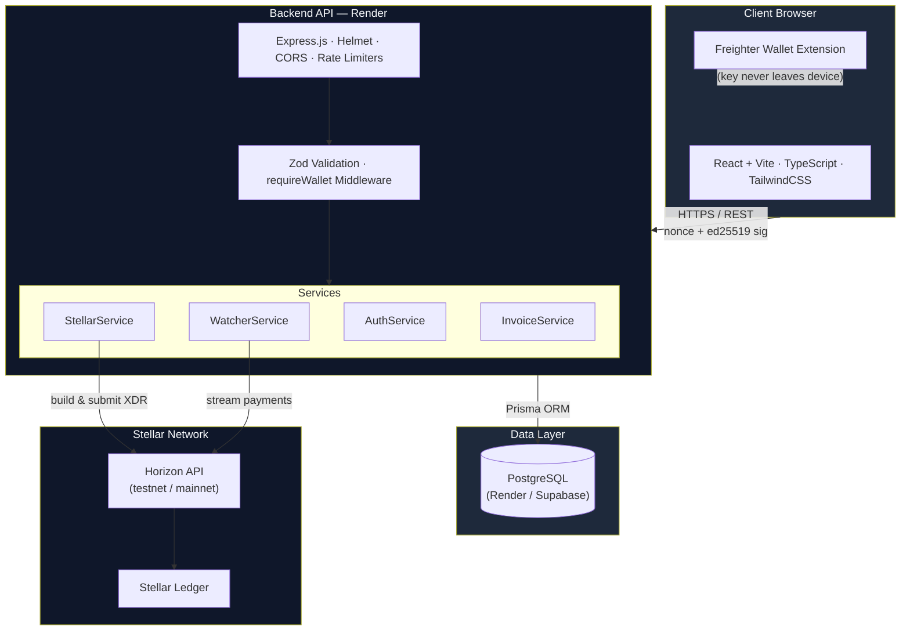
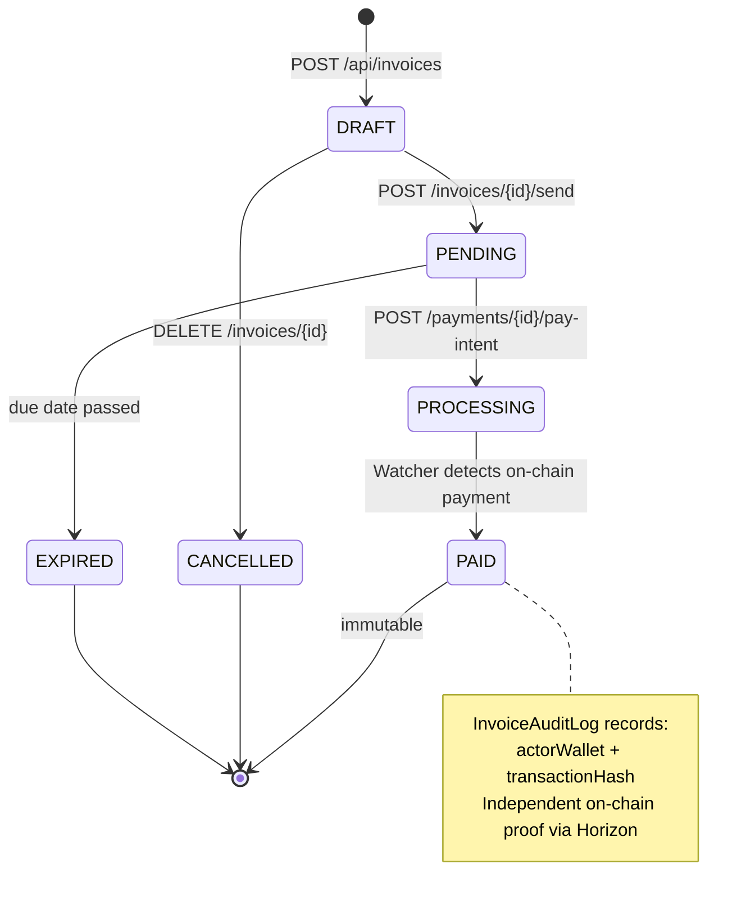
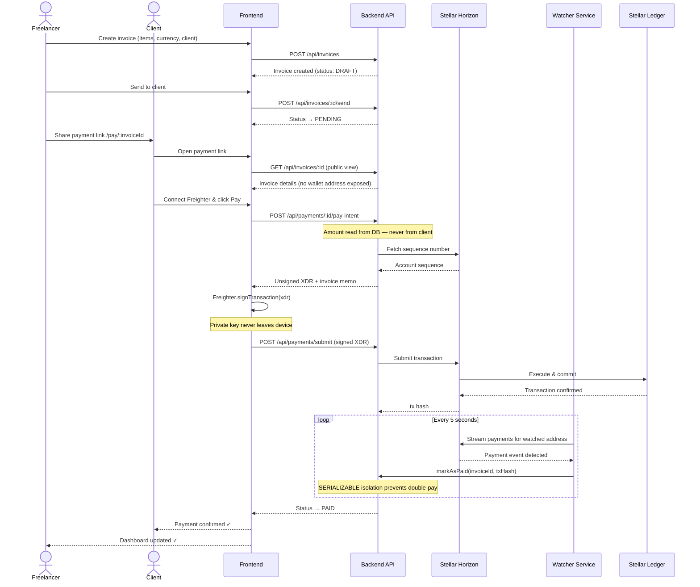
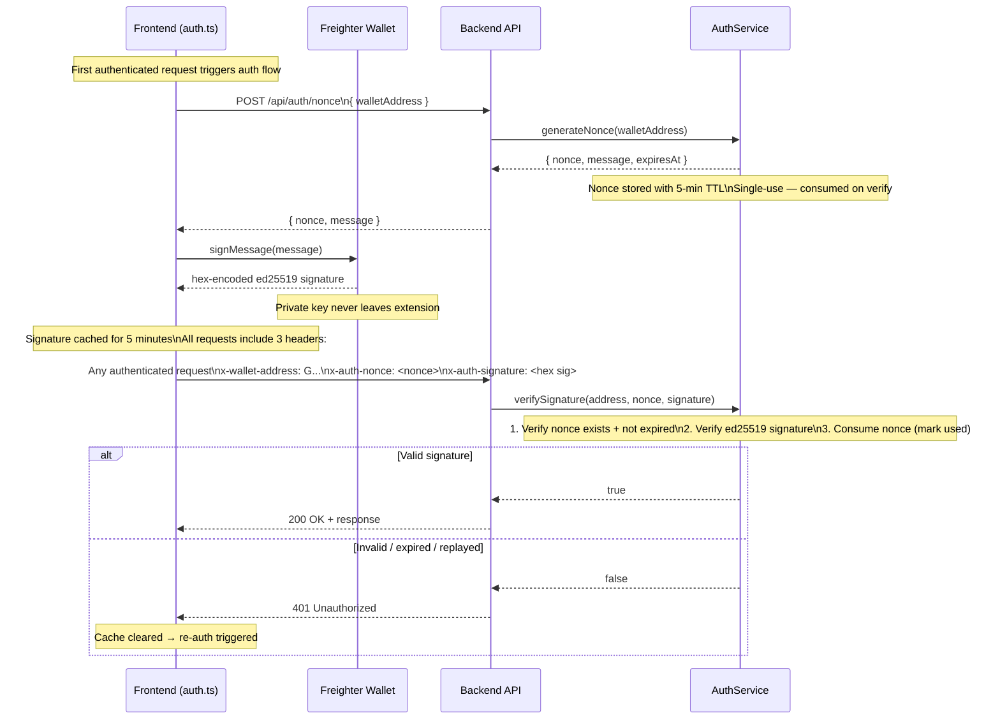

<div align="center">

# Link2Pay

**Payment Links Infrastructure on Stellar**

Create hosted crypto checkout links, embed payment flows in your app, and receive instant on-chain confirmation.

[](https://stellar.org)
[](https://www.typescriptlang.org/)
[](https://nodejs.org/)
[](https://react.dev/)
[](./LICENSE)

[Live Demo](https://link2pay.vercel.app) · [API Reference](#api-endpoints) · [Quick Start](#quick-start) · [Security Model](#security-model)

---

</div>

## Table of Contents

- [Overview](#overview)
- [Core Features](#core-features)
- [Architecture](#architecture)
- [How It Works](#how-it-works)
  - [Invoice Lifecycle](#invoice-lifecycle)
  - [Payment Flow](#payment-flow)
  - [Authentication Flow](#authentication-flow)
- [Quick Start](#quick-start)
- [Project Structure](#project-structure)
- [API Endpoints](#api-endpoints)
- [Environment Variables](#environment-variables)
- [Technology Stack](#technology-stack)
- [Security Model](#security-model)
- [Deployment](#deployment)

---

## Overview

**Link2Pay** is a full-stack payment-link infrastructure platform built on Stellar. Builders create a payment link (payment intent), redirect users to hosted checkout, and track confirmation through API status polling. Payments settle in 3–5 seconds with near-zero network fees.

### The Problem

Traditional invoicing tools require:

- 2–3% payment processor fees with multi-day settlement delays
- Custodial services that hold funds on your behalf
- Complex exchange flows for multi-currency invoicing
- Trust in a third party for payment verification

**Link2Pay solves this** by settling payments directly on-chain using XLM, USDC, or EURC. Cryptographic proof of payment is stored permanently on Stellar's ledger — no third party required.

---

## Core Features

### Invoice Management
Create professional invoices with line items, tax rates, discounts, and due dates. Full support for XLM, USDC, and EURC.

### Shareable Payment Links
Every invoice generates a unique public URL (`/pay/:invoiceId`). Clients open the link and pay directly — no account or registration required.

### Non-Custodial Wallet Integration
Freighter wallet signs all transactions client-side. Private keys never leave the user's device. The server only verifies signatures against the on-chain public key.

### Cryptographic Authentication
Nonce-based ed25519 challenge-response authentication. Every authenticated request requires a server-issued nonce signed by the Freighter wallet — no passwords, no sessions, no JWTs.

### Instant Blockchain Settlement
3–5 second finality on the Stellar network. The payment watcher monitors Horizon in real time and marks invoices as PAID automatically upon on-chain confirmation.

### Immutable Audit Trail
Every invoice state transition (CREATED → SENT → PROCESSING → PAID) is recorded in `InvoiceAuditLog` with actor wallet and timestamp. The on-chain transaction hash provides independent, verifiable proof.

### Real-Time Dashboard
Live statistics — total invoices, revenue, pending amounts — scoped to the authenticated wallet. No data leakage across users.

### Multi-Asset Price Display
Live XLM/USD equivalent shown at payment time via CoinGecko pricing, cached server-side to avoid rate limits.

### Saved Client Book
Reuse client details across invoices with an optional favorites system and quick-fill at invoice creation.

---

## Highlights



**Trust Boundaries**

| Boundary | Trust Level | Verification |
|---|---|---|
| Browser → Backend | Untrusted | Nonce + ed25519 signature on every request |
| Backend → Horizon | Trusted source, verified data | Transaction details re-verified independently |
| Backend → Database | Trusted (internal) | Prisma parameterized queries; no raw SQL |
| Watcher → Horizon | Trusted source, verified data | Invoice number in memo re-checked on confirm |

---

## How It Works

### Invoice Lifecycle



---

### Payment Flow



---

### Authentication Flow



---

## Quick Start

Hackathon project. Ready for demos and local deployments; production hardening is still in progress.

- **Node.js** v18+ ([nodejs.org](https://nodejs.org/))
- **Docker** + Docker Compose (for local PostgreSQL)
- **Freighter** browser extension ([freighter.app](https://freighter.app))

### Automated Setup

```bash
git clone https://github.com/Link2Pay/link2pay-app.git
cd link2pay-app

# Installs all dependencies, starts Docker Postgres,
# applies DB schema, and builds both services
./setup.sh
```

### Start the Application

```bash
./link2pay
```

| Service | URL |
|---|---|
| Frontend | http://localhost:4173 |
| Backend API | http://localhost:3001 |
| Health check | http://localhost:3001/api/health |

### Manual Setup

```bash
# 1. Backend
cd backend
cp .env.example .env       # fill in DATABASE_URL and other vars
npm install
npx prisma generate
npx prisma db push          # or: npx prisma migrate deploy
npm run build

# 2. Frontend
cd ../frontend
cp .env.example .env        # set VITE_API_URL=http://localhost:3001
npm install
npm run build

# 3. Start PostgreSQL
docker compose up -d postgres

# 4. Start backend (terminal 1)
cd backend && npm start

# 5. Start frontend (terminal 2)
cd frontend && npx vite preview --port 4173
```

### Connect Freighter

1. Install [Freighter](https://freighter.app) browser extension
2. Switch to **Stellar Testnet** in Freighter settings
3. Fund your testnet account at [friendbot.stellar.org](https://friendbot.stellar.org)
4. Open http://localhost:4173 and connect wallet

---

## Project Structure

```
link2pay-app/
├── backend/
│   ├── prisma/
│   │   └── schema.prisma              # Invoice, Payment, Client, AuditLog models
│   └── src/
│       ├── index.ts                   # Express server, Helmet CSP, CORS, rate limiters
│       ├── config/
│       │   └── index.ts               # Env var validation with Zod at startup
│       ├── routes/
│       │   ├── auth.ts                # POST /auth/nonce — nonce issuance
│       │   ├── invoices.ts            # Invoice CRUD + per-wallet rate limiter
│       │   ├── payments.ts            # pay-intent, submit, confirm, status
│       │   ├── prices.ts              # XLM/USD price feed (CoinGecko, cached)
│       │   └── clients.ts             # Saved client book
│       ├── services/
│       │   ├── invoiceService.ts      # Business logic + SERIALIZABLE transactions
│       │   ├── stellarService.ts      # XDR construction, Horizon interaction
│       │   ├── watcherService.ts      # Real-time Horizon payment stream watcher
│       │   └── authService.ts         # Nonce generation + ed25519 verification
│       ├── middleware/
│       │   └── validation.ts          # Zod request validation + requireWallet guard
│       ├── types/
│       │   └── index.ts               # InvoicePublicView, InvoiceOwnerView, etc.
│       └── utils/
│           └── generators.ts          # CUID / random invoice number generators
│
├── frontend/
│   └── src/
│       ├── App.tsx                    # Routes + context providers
│       ├── components/
│       │   ├── Layout.tsx             # Sidebar + top navigation
│       │   ├── Invoice/               # InvoiceForm, InvoiceList, InvoiceDetail
│       │   ├── Wallet/                # Freighter connection flow
│       │   └── Payment/               # Public payment page (client-facing)
│       ├── services/
│       │   ├── api.ts                 # Typed backend API client
│       │   └── auth.ts                # Nonce fetch + 5-min signature cache
│       ├── store/
│       │   └── walletStore.ts         # Zustand wallet state + signMessage / signTx
│       ├── i18n/
│       │   └── translations.ts        # EN / ES / PT translations
│       └── pages/
│           ├── Dashboard.tsx
│           └── CreateInvoice.tsx
│
├── SECURITY.md                        # STRIDE threat model + per-threat remediation status
├── SECURITY_REFERENCE.md              # General Stellar / Web3 security reference
├── docker-compose.yml                 # Local PostgreSQL on port 5433
├── setup.sh                           # One-command bootstrap script
├── link2pay                           # Launcher (Docker + backend + frontend)
└── README.md
```

---

1. Freelancer connects Freighter wallet.
2. Freelancer creates and shares an invoice link.
3. Client opens `/pay/:invoiceId`, connects wallet, signs payment.
4. Invoice status updates after on-chain confirmation.

All endpoints are prefixed with `/api`. Authenticated endpoints require three request headers:

```
x-wallet-address    Stellar public key (G...)
x-auth-nonce        Server-issued single-use nonce
x-auth-signature    Hex-encoded ed25519 signature of the nonce message
```

### Auth

| Method | Path | Description | Auth |
|---|---|---|---|
| `POST` | `/auth/nonce` | Issue a single-use nonce (5-min TTL) | — |

### Invoices

| Method | Path | Description | Auth |
|---|---|---|---|
| `POST` | `/invoices` | Create invoice *(20/hr per wallet)* | Wallet |
| `GET` | `/invoices` | List authenticated wallet's invoices | Wallet |
| `GET` | `/invoices/stats` | Dashboard statistics | Wallet |
| `GET` | `/invoices/:id` | Public invoice view (no wallet address) | — |
| `GET` | `/invoices/:id/owner` | Full invoice for owner | Wallet |
| `PATCH` | `/invoices/:id` | Update DRAFT invoice | Wallet |
| `POST` | `/invoices/:id/send` | Mark invoice PENDING | Wallet |
| `DELETE` | `/invoices/:id` | Soft-delete DRAFT invoice | Wallet |

- Linux
- Node.js `18+`
- npm
- Docker Engine + Docker Compose plugin

| Method | Path | Description | Auth |
|---|---|---|---|
| `POST` | `/payments/:id/pay-intent` | Build payment XDR *(10 req / 5 min per IP)* | — |
| `POST` | `/payments/submit` | Submit signed XDR to Stellar | — |
| `POST` | `/payments/confirm` | Manually confirm by transaction hash | — |
| `GET` | `/payments/:id/status` | Poll payment status | — |
| `POST` | `/payments/verify-tx` | Verify transaction on-chain | — |

### Prices

| Method | Path | Description | Auth |
|---|---|---|---|
| `GET` | `/prices/xlm` | XLM/USD rate *(30 req / 60 s per IP)* | — |

### Clients

| Method | Path | Description | Auth |
|---|---|---|---|
| `GET` | `/clients` | List saved clients | Wallet |
| `POST` | `/clients` | Save a new client | Wallet |
| `PATCH` | `/clients/:id/favorite` | Toggle favorite | Wallet |
| `DELETE` | `/clients/:id` | Delete client | Wallet |

---

`./setup.sh` automates env file preparation, Docker PostgreSQL startup, dependency install, Prisma sync, and backend/frontend builds.

### Backend — `backend/.env`

| Variable | Description | Default |
|---|---|---|
| `PORT` | Server port | `3001` |
| `DATABASE_URL` | PostgreSQL connection string | Required |
| `STELLAR_NETWORK` | `testnet` or `mainnet` | `testnet` |
| `HORIZON_URL` | Stellar Horizon API URL | Testnet URL |
| `NETWORK_PASSPHRASE` | Stellar network passphrase | Testnet passphrase |
| `FRONTEND_URL` | Frontend origin for CORS allowlist | `http://localhost:5173` |
| `WATCHER_POLL_INTERVAL_MS` | Payment watcher poll interval | `5000` |
| `NODE_ENV` | `development` or `production` | `development` |

### Frontend — `frontend/.env`

| Variable | Description | Default |
|---|---|---|
| `VITE_API_URL` | Backend API base URL | `http://localhost:3001` |
| `VITE_STELLAR_NETWORK` | Stellar network | `testnet` |
| `VITE_HORIZON_URL` | Horizon API URL | Testnet URL |
| `VITE_NETWORK_PASSPHRASE` | Network passphrase | Testnet passphrase |

---

## Technology Stack

Stop local app with `Ctrl+C`.

| Layer | Technology |
|---|---|
| Framework | React 18, TypeScript, Vite |
| Styling | TailwindCSS |
| State Management | Zustand, React Query |
| Wallet | @stellar/freighter-api |
| Internationalization | Custom (EN / ES / PT) |

### Backend

| Layer | Technology |
|---|---|
| Runtime | Node.js 18+, TypeScript |
| Framework | Express.js |
| ORM | Prisma |
| Database | PostgreSQL |
| Logging | Winston (JSON in production) |
| Validation | Zod schemas on all request bodies |

### Blockchain

| Layer | Technology |
|---|---|
| Network | Stellar (testnet / mainnet) |
| SDK | @stellar/stellar-sdk v12 |
| API | Horizon REST API |
| Wallet | Freighter (ed25519 signing) |
| Supported Assets | XLM (native), USDC, EURC |

### Security

| Layer | Technology |
|---|---|
| HTTP Headers | Helmet.js — CSP, HSTS, X-Frame-Options |
| Authentication | Nonce + ed25519 challenge-response |
| Rate Limiting | express-rate-limit (global + per-endpoint + per-wallet) |
| Input Validation | Zod on all request bodies; Prisma parameterized queries |
| CORS | Restricted to known frontend origins |

---

## Security Model

Link2Pay applies **STRIDE threat modeling** (see [`SECURITY.md`](./SECURITY.md)) and follows [SDF Security Best Practices](https://stellar.org/developers).

### Key Security Properties

| Property | Implementation |
|---|---|
| **Non-custodial** | Private keys never leave Freighter. Server holds and verifies public keys only. |
| **Cryptographic auth** | Every authenticated request requires a server-issued nonce signed with the wallet's ed25519 key. |
| **No address spoofing** | `requireWallet` rejects requests missing `x-auth-nonce` or `x-auth-signature`. No legacy fallback. |
| **Server-side amounts** | Invoice `total` is always read from the DB — client-supplied amounts are never trusted. |
| **Non-sequential IDs** | CUID for database IDs, random alphanumeric for invoice numbers — prevents enumeration. |
| **Field-level access control** | Public endpoints return `InvoicePublicView` (no wallet address). Owner endpoints require auth. |
| **IDOR prevention** | All owner queries filter by authenticated `walletAddress` at the database level. |
| **Rate limiting** | Global: 100 req/15 min · Pay-intent: 10 req/5 min · Invoice creation: 20/hr per wallet. |
| **CSP + HSTS** | Helmet configures `Content-Security-Policy` and `Strict-Transport-Security` on every response. |
| **Audit trail** | `InvoiceAuditLog` records every state transition with actor wallet and timestamp. |
| **Race condition protection** | `markAsPaid` uses `SERIALIZABLE` isolation to prevent double-payment on concurrent requests. |

### Attack Resistance

| Attack Vector | Status | Mechanism |
|---|---|---|
| Wallet impersonation | ✅ Mitigated | ed25519 signature verification on every request |
| Nonce replay | ✅ Mitigated | Single-use nonces consumed on verify, 5-min TTL |
| Amount tampering | ✅ Mitigated | Amount always read from DB, never from request body |
| XDR replay | ✅ Mitigated | 5-min transaction timeout + invoice memo binding |
| IDOR | ✅ Mitigated | DB-level wallet filter on all owner queries |
| ID enumeration | ✅ Mitigated | CUID + random alphanumeric invoice numbers |
| Wallet address disclosure | ✅ Mitigated | `InvoicePublicView` type excludes `freelancerWallet` |
| Invoice creation flood | ✅ Mitigated | 20 invoices/hr per wallet rate limit |
| Clickjacking | ✅ Mitigated | `X-Frame-Options: DENY` via Helmet |
| MIME sniffing | ✅ Mitigated | `X-Content-Type-Options: nosniff` via Helmet |
| Double payment | ✅ Mitigated | `SERIALIZABLE` DB transaction on `markAsPaid` |

---

| Variable | Required | Purpose |
| --- | --- | --- |
| `DATABASE_URL` | Yes | PostgreSQL connection string |
| `PORT` | No | API port (default `3001`) |
| `FRONTEND_URL` | No | CORS origin for frontend |
| `STELLAR_NETWORK` | No | `testnet` or `mainnet` |
| `HORIZON_URL` | No | Stellar Horizon endpoint |
| `NETWORK_PASSPHRASE` | No | Stellar network passphrase |

### Frontend (`frontend/.env`)

```bash
cd frontend
npm run build
vercel --prod
# vercel.json configures CSP, HSTS, Referrer-Policy, and cache headers automatically
```

### Backend → Render

```bash
# Backend dev server (watch mode)
cd backend
npm run build
# Set all environment variables in the Render dashboard
# Build command:  npm run build
# Start command:  npm start
# On first deploy, run migrations:
npx prisma migrate deploy
```

### Database → Render PostgreSQL / Supabase

Set `DATABASE_URL` from your provider's connection string, then apply the schema:

```bash
cd backend
DATABASE_URL="postgresql://..." npx prisma migrate deploy
```

---

<div align="center">

**Built on Stellar · Settled on-chain · Secured by ed25519**

</div>
